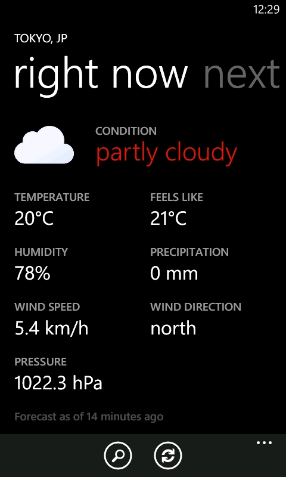
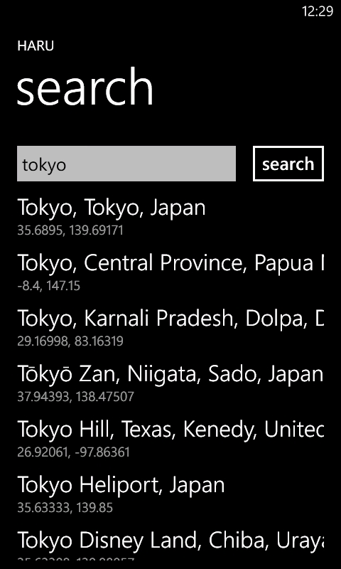
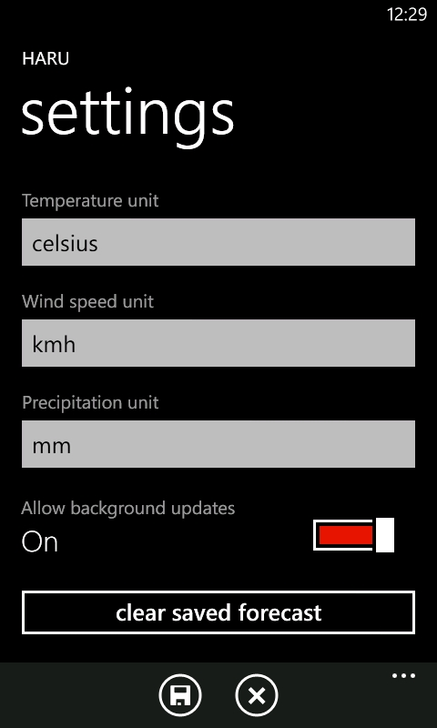
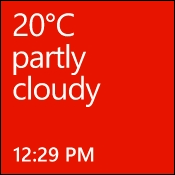

# Haru

A clean, modern weather application for Windows Phone that brings beautiful weather forecasts to your device.


## Features

### Comprehensive Weather Data
- **Current conditions** with temperature, humidity, precipitation, wind, and pressure
- **Hourly forecasts** for the next 12 hours
- **Daily forecasts** for the next 7 days
- Beautiful weather icons with day/night variants
- Detailed weather descriptions and interpretations

### Smart Location Search
- Search locations worldwide
- Detailed location information with administrative regions
- Easy location management

### Live Tile Integration
- Auto-updating live tile with current weather
- Temperature and conditions displayed on tile back
- Background updates every 30 minutes (when connected to Wi-Fi)
- Smart offline caching - shows last known weather when network unavailable
- Battery-efficient with network availability checks

### Customizable Settings
- **Temperature units**: Celsius (°C) or Fahrenheit (°F)
- **Wind speed units**: km/h, m/s, mph, or knots
- **Precipitation units**: mm or inches
- Toggle background tile updates
- Clear cached forecast data

### Offline Support
- Automatic weather data caching
- Displays last known conditions when offline
- Seamless online/offline transitions

## Screenshots

|||||
|:---:|:---:|:---:|:---:|
|Splash Screen|Current Weather|Location Search|Settings|

|||||
|:---:|:---:|:---:|:---:|
|Live Tile Front (no location)|Live Tile Back (no location)|Live Tile Front (location set)|Live Tile Back (location set)|


## Installation

> [!IMPORTANT]
> Make sure your device is configured to allow app sideloading.

### Option 1: From XAP File (Sideloading)
1. Download the latest `.xap` file from the [Releases](../../releases) page
2. Connect your Windows Phone device to your computer
3. Use the **Windows Phone Application Deployment Tool** to deploy the XAP
4. Launch Haru from your app list

### Option 2: From Source
See [Build Instructions](#build-instructions) below

## Build Instructions

### Prerequisites

- **Windows 7** or higher
- **Zune software** (for Windows Phone 7 device deployment)
- **Git**
- **NuGet**
- **Visual Studio 2010** or **Visual Studio 2012**
- **Windows Phone SDK 7.1**

### Required NuGet Packages

The project uses the following NuGet packages:

- `WPtoolkit` (4.2013.08.16)
- `Newtonsoft.Json` (4.5.11)
- `NodaTime` (1.2.0)

### Build Steps

1. **Clone the repository**
   ```bash
   git clone https://github.com/FriendsNone/Haru.git
   cd Haru
   ```

2. **Open the solution**
   - Open `Haru.sln` in Visual Studio

3. **Restore NuGet packages**
   - Right-click on the solution in Solution Explorer
   - Select **Manage NuGet Packages for Solution...**
   - Click **Restore** to download missing packages

4. **Set HaruApp as startup project**
   - Right-click on `HaruApp` project
   - Select **Set as StartUp Project**

5. **Build the solution**
   - Select **Build > Build Solution**
   - Ensure `HaruCore`, `HaruApp`, and `HaruAgent` projects build successfully

6. **Deploy to device or emulator**
   - Select **Emulator** or **Device** from the dropdown
   - Select **Debug > Start Debugging** or press `F5`

## Contributing

Contributions are welcome! Please feel free to submit pull requests or open issues.

### Development Guidelines

- Follow existing code style and patterns
- Use LINQ for collection operations
- Keep methods concise and focused
- Add comments for complex logic
- Test on actual Windows Phone 7 device when possible

## License

This project is licensed under the MIT License - see the [LICENSE](LICENSE) file for details.

## Acknowledgments

- [Open-Meteo](https://open-meteo.com) for weather and geocoding APIs
- [basmilius](https://github.com/basmilius/weather-icons) for weather icons
- [Fluent System Icons](https://github.com/microsoft/fluentui-system-icons) for Haru app icon
- Built for the Windows Phone community

## Support

Having issues? Here are some resources:
- Check the [Issues](../../issues) page for known problems